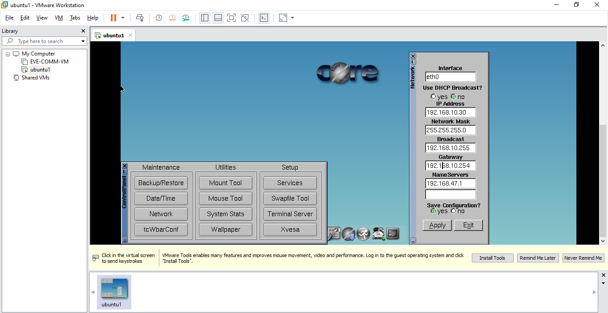

> Andrea Nicte Vicente Campos
>
> 201404104

# Topología

.png)

# Configuracion 

Para la siguiente topologica se utlizaron:

- 1 router
- 2 switch
- 3 vpc
- 1 virutal linux

## Configuracion del router

Comandos para la configuracion de la primera interfaz f0/0

> $configure terminal

> $interface fastEthernet 0/0

> $ip address 192.168.14.254 255.255.255.0

> $no shtudown

> $exit

Comandos para la configuracion de la primera interfaz f0/1

> $configure terminal

> $interface fastEthernet 0/1

> $ip address 192.168.10.254 255.255.255.0

> $no shtudown

> $exit

Configurar la velcoidad para ambos interfaces

> $interface fastEthernet 0/0

> $speed 100

> $duplex full

> $exit

> $interface fastEthernet 0/1

> $speed 100

> $duplex full

> $exit

Para guardar la configuracion del router

> $write memory

## Configuracion vpc

PC3

> $ip 192.168.14.30 255.255.255.0

> $ip 192.168.14.30 255.255.255.0 192.168.14.254

> $save config.txt

PC2

> $ip 192.168.14.15 255.255.255.0

> $ip 192.168.14.15 255.255.255.0 192.168.14.254

> $save config.txt

PC1

> $ip 192.168.10.15 255.255.255.0

> $ip 192.168.10.15 255.255.255.0 192.168.10.254

> $save config.txt

## Configuracion maquina virutal

# Glosario

| Palabras      | Definicion                                                   |
| ------------- | ------------------------------------------------------------ |
| Direccion MAC | Identificador unico que cada fabricante, le asigna a la tarjeta de red de sus dispositivos conectados |
| IP            | Identifica de manera logica y jerárquica de una intefaz en la red |
| Getaway       | Comunmente equipo informático configurado para dotar a las máquinas de una red local (LAN) conectadas a él de un acceso hacia una red exterior, generalmente realizando para ello operaciones de traducción de direcciones IP (NAT: Network Address Translation) |
| LAN           | Denomina redes con extensión física limitada                 |
| NAT           | La traducción de dirección de red o NAT se refiere a un proceso específico que implica la reordenación de una única dirección IP en otra dirección IP, a menudo pública, mediante la alteración de la información de red y la información de dirección que se encuentra en la cabecera IP de los paquetes de datos. |
| Router        | Dispositivo dedicado a la tarea de administrar el tráfico de información que circula por una red de computadoras. |
| Switch        | Su funcion es la de unir o conectar dispositivos en red. Es importante tener claro que un switch NO proporciona por si solo conectividad con otras redes, y obviamente, TAMPOCO proporciona conectividad con Internet. |
| VPC           | Virtual port channel                                         |
| VLAN          | Virtual LAN, método que permite crear redes que lógicamente son independientes, aunque estas se encuentren dentro de una misma red física. |
| Bordcast      | Es un mensaje que se transmite a todos los miembros de una red y que no necesita ninguna acción de retroalimentación. |

